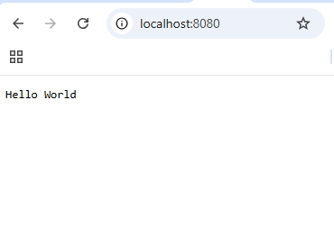

# Experiment 1

## Setup Environment and Display Hello World using Node.js

### Aim

To set up the Node.js development environment and create a simple
application that displays **Hello World** using Nodejs

------------------------------------------------------------------------

### Technologies Used

-   Node.js

------------------------------------------------------------------------

### Software Requirements

-   Node.js (LTS Version)
-   Visual Studio Code or any code editor

------------------------------------------------------------------------

### Installation Steps

1.  Install **Node.js** from https://nodejs.org\
2.  Verify installation using the following commands in terminal

                            node -v
                            npm -v

3.  Create a project folder

                            mkdir Experiment-1
                            cd Experiment-1

4.  Initialize Node.js project

                            npm init -y

------------------------------------------------------------------------

### Project Structure

Experiment-1\
├── package.json\
└── server.js

------------------------------------------------------------------------

### Steps to Run the Application

Run the following command in the terminal

node server.js

Open the browser and go to

http://localhost:8080

------------------------------------------------------------------------

### Output

