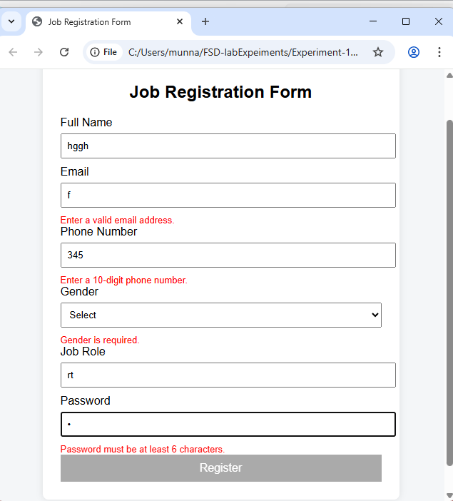
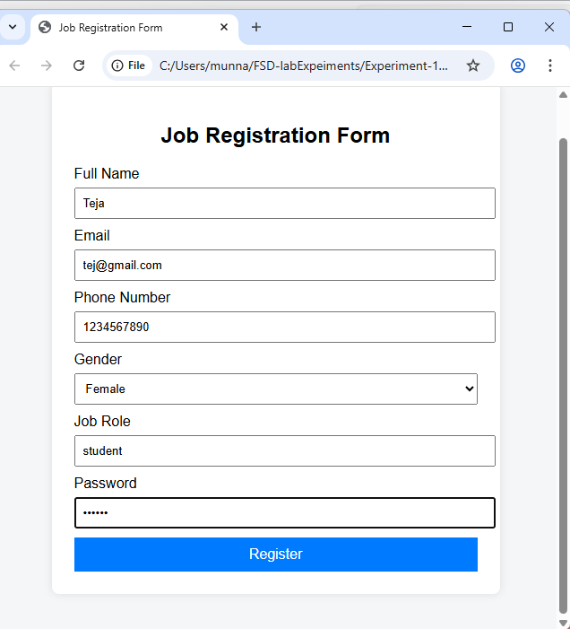

# Experiment 10

## Develop a Job Registration Form and Validate it using AngularJS

---

## Aim

The aim of this experiment is to develop a **Job Registration Form using AngularJS** and perform **form validations**.  
This experiment helps in understanding how to:

- Create a dynamic form using AngularJS directives
- Implement real-time validation for required fields, email format, phone pattern, and password length
- Display error messages when validation fails
- Enable or disable the submit button based on form validation

---

## Technologies Used

- HTML5
- CSS3
- AngularJS (1.x)
- JavaScript

---

## Key Concepts

A job registration form can be developed in AngularJS using built-in validation directives such as:

- `required`
- `ng-pattern`
- `ng-minlength`
- `ng-maxlength`

AngularJS also provides form and input states such as:

- `$valid`
- `$invalid`
- `$dirty`
- `$touched`

These states help in controlling validation messages and form submission behavior.

The form also uses:

- `ng-model` for two-way data binding
- `ng-submit` for form submission
- `ng-disabled` to disable submit button until form is valid

---

## Features of the Job Registration Form

- Uses AngularJS (1.x)
- Validates required fields
- Validates email format
- Validates phone number pattern
- Validates minimum password length
- Requires gender selection
- Shows real-time validation error messages
- Disables submit button until form becomes valid

---

## How to Execute the Program

### Step 1
Create a folder

```
Experiment-10
```

### Step 2
Create a file

```
job-registration.html
```

### Step 3
Copy the job-registration.html code

### Step 4
Open the file in a browser

```
Double click job-registration.html
```

or run using **VS Code Live Server**.

---

## AngularJS Validation Concepts Used

| Feature | Directive |
|-------|-----------|
| Required field | `required` |
| Email validation | `type="email"` |
| Pattern validation | `ng-pattern` |
| Minimum length | `ng-minlength` |
| Form state | `jobForm.$invalid` |
| Field touched state | `$touched` |
| Data binding | `ng-model` |

---

## How Validation Works

- Error messages appear only after the user touches the field
- Submit button stays disabled until the form becomes valid
- AngularJS automatically tracks form validity using `$valid` and `$invalid`

---

## Result

The **Job Registration Form** was successfully developed using **AngularJS** with real-time validation, dynamic error messages, and controlled form submission.

---

### Output


