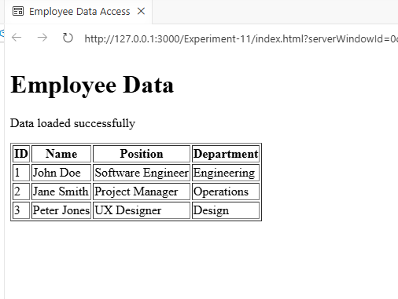

# Experiment-11

## AngularJS Application to Access Employee JSON Data Using \$http Service

------------------------------------------------------------------------

## Aim

The aim of this experiment is to develop an AngularJS application that
accesses employee data from a JSON file using the `$http` service. The
application retrieves employee information from a server and dynamically
displays it on a web page.

------------------------------------------------------------------------

## Objectives

This experiment helps in understanding:

-   How to use AngularJS `$http` service to fetch data from a JSON file.
-   How to display JSON data dynamically using AngularJS directives.
-   How to implement AngularJS modules and controllers.
-   How to handle HTTP responses and errors.
-   How to iterate through data using `ng-repeat`.

------------------------------------------------------------------------

## Key Concepts

**AngularJS Module:** Organizes application components.\
**Controller:** Controls application logic and connects data with the
view.\
**\$http Service:** Used to communicate with servers through HTTP
requests.\
**JSON (JavaScript Object Notation):** Lightweight data format used to
store and exchange data.\
**ng-repeat:** AngularJS directive used to display lists of data
dynamically.

------------------------------------------------------------------------

## Prerequisites

Before running the project ensure the following:

-   Visual Studio Code installed
-   Web Browser (Chrome / Edge / Firefox)
-   Live Server extension in VS Code
-   Internet connection to load AngularJS CDN

------------------------------------------------------------------------

## Project Setup

### Step 1: Create Project Folder

Create a folder named:

EmployeeApp

Inside it create the following files:

-   index.html
-   app.js
-   employees.json

------------------------------------------------------------------------

## Project Structure

EmployeeApp\
│\
├── index.html\
├── app.js\
└── employees.json

------------------------------------------------------------------------

## How to Run the Application

1.  Open the project folder in **Visual Studio Code**.
2.  Install the **Live Server extension**.
3.  Right click on `index.html`.
4.  Click **Open with Live Server**.
5.  The browser will open automatically and display the employee table.

------------------------------------------------------------------------
### Output

