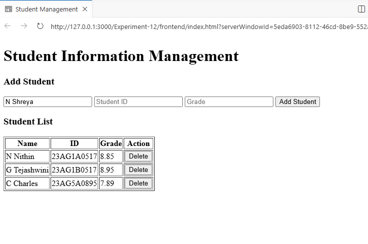
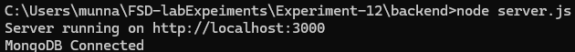
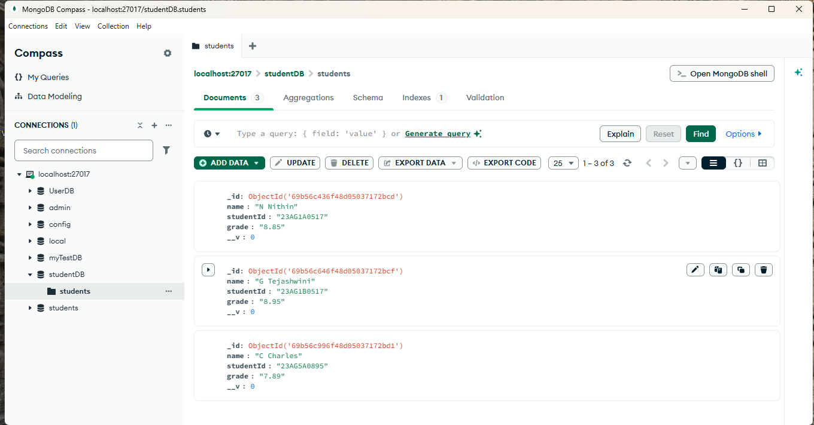

# Experiment-12

## Student Information Management System using Express.js and AngularJS

------------------------------------------------------------------------

### Aim

The aim of this experiment is to develop a web application using
**Express.js (backend)** and **AngularJS (frontend)** to manage student
information. The system allows users to add, view, update, and delete
student records.

------------------------------------------------------------------------

### Objectives

This experiment helps in understanding:

-   Building a backend server using **Express.js**
-   Creating REST APIs for CRUD operations
-   Connecting Node.js to **MongoDB** using **Mongoose**
-   Developing a frontend using **AngularJS**
-   Using AngularJS **\$http service** to communicate with the backend
-   Dynamically displaying and managing student data

------------------------------------------------------------------------

### Prerequisites

Before starting the experiment ensure the following are installed:

-   Node.js
-   npm (Node Package Manager)
-   MongoDB
-   Visual Studio Code
-   Live Server Extension (VS Code)
-   Basic knowledge of JavaScript, HTML, AngularJS and Express.js

------------------------------------------------------------------------

### Project Structure

student-management-app\
│\
├── backend\
│ ├── node_modules\
│ ├── server.js\
│ └── package.json\
│\
└── frontend\
├── index.html\
└── app.js

------------------------------------------------------------------------

### Backend Setup (Express.js)

#### Step 1: Initialize Node Project

Navigate to the backend folder and run:

    npm init -y

#### Step 2: Install Required Packages

    npm install express body-parser cors mongoose

Packages used:

-   **express** → Web server framework
-   **body-parser** → Parses JSON request bodies
-   **cors** → Allows cross-origin requests
-   **mongoose** → MongoDB object modeling tool

------------------------------------------------------------------------

### How to Run the Application

#### Step 1: Start Backend Server

Navigate to backend folder and run:

    node server.js

Expected Output:

    MongoDB Connected
    Server running on http://localhost:3000

------------------------------------------------------------------------

#### Step 2: Run Frontend

Open `index.html` using **Live Server** in VS Code.

------------------------------------------------------------------------

### Output 
---

