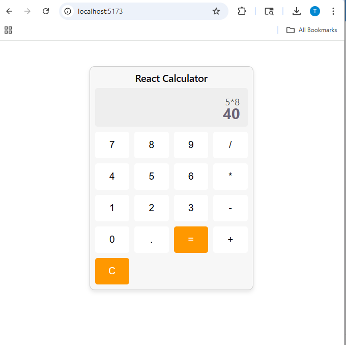

# Experiment-13

## Simple Calculator Application using ReactJS

------------------------------------------------------------------------

### Aim

The aim of this experiment is to develop a simple calculator application
using **ReactJS**. The application allows users to perform basic
arithmetic operations such as:

-   Addition
-   Subtraction
-   Multiplication
-   Division

------------------------------------------------------------------------

### Objectives

This experiment helps in understanding:

-   Creating a React application using **Vite**
-   Using **React functional components**
-   Managing application state using **useState hook**
-   Handling button click events
-   Performing arithmetic calculations
-   Styling components using CSS

------------------------------------------------------------------------

### Prerequisites

Before starting the experiment ensure the following software is
installed:

-   Node.js
-   npm (Node Package Manager)
-   Visual Studio Code
-   Basic knowledge of JavaScript, ReactJS, HTML, and CSS

------------------------------------------------------------------------

### Project Setup

#### Create React Project

Open terminal and run:

    npm create vite@latest calculator-app -- --template react
    cd calculator-app
    npm install
    npm run dev

After running the command, the development server will start and the
application will be available at:

    http://localhost:5173

------------------------------------------------------------------------

### Project Structure

calculator-app\
│\
├── node_modules\
├── public\
├── src\
│ ├── App.jsx\
│ ├── App.css\
│ ├── main.jsx\
│ └── index.css\
│\
├── index.html\
├── package.json\
├── package-lock.json\
├── vite.config.js\
└── README.md

------------------------------------------------------------------------

### How to Run the Application

1.  Navigate to the project folder

```{=html}
<!-- -->
```
    cd calculator-app

2.  Start the development server

```{=html}
<!-- -->
```
    npm run dev

3.  Open the browser and go to

```{=html}
<!-- -->
```
    http://localhost:5173

------------------------------------------------------------------------
### Output
---
