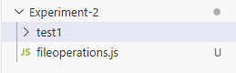
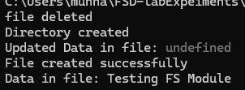

# Experiment 2

## Write a Node.js program to perform read, write and other operations on a file

### Aim
To develop a Node.js program that performs file operations such as writing, reading, appending, and renaming files using the File System (fs) module.

---

### Technologies Used
- Node.js
- JavaScript
- File System (fs) Module

---

### Software Requirements
- Node.js (LTS version)
- Visual Studio Code
 
---

### Theory
Node.js provides a built-in module called **fs (File System)** which allows interaction with the file system on the computer. Using this module, we can create, read, update, append, rename, and delete files.

Some commonly used file operations are:

- `fs.writeFile()` – Creates a file and writes data into it.
- `fs.readFile()` – Reads the content of a file.
- `fs.appendFile()` – Adds data to an existing file.
- `fs.rename()` – Renames a file.

---
 ### Folder structure

 Experiment-2/
    |_screenshots/
    |_test1/
    |_fileoperations.js
    |_README.md

---

### Run the program
 
    node fileoperations.js

---

### Output

