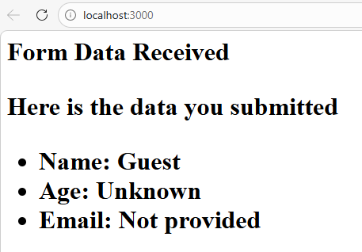
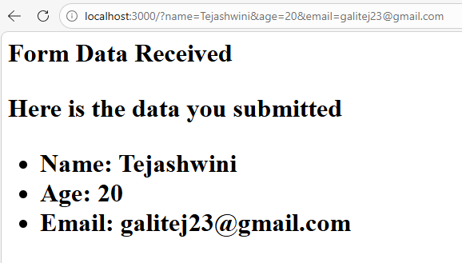

# Experiment 3

## Write a NodeJS Program to read form data from query string and generate response using NodeJS

### Aim
To create a Node.js application that reads form data from the query string and generates a response using the HTTP module.

---

### Technologies Used
- Node.js
- JavaScript
- HTTP Module

---

### Theory
In Node.js, the **URL module** is used to parse the query string from a URL. Query strings are parameters passed in the URL after the question mark (?).

Example:

http://localhost:3000/?name=Tejashwini&age=20&email=galitej23@gmail.com

Here name, age and email are query parameters.

---

### Folder structure

Experiment-4/
    |_screenshots/
    |_README.md
    |_server.js
 
---

### Run the program

        node server.js

---

### Output

