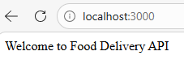
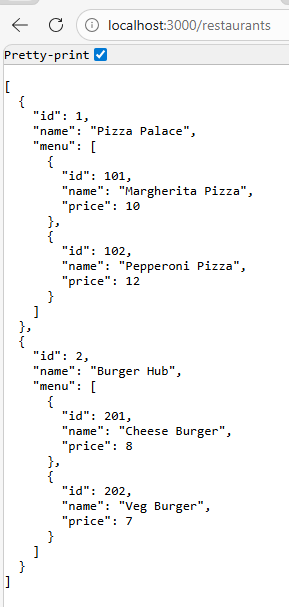
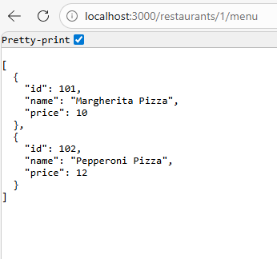
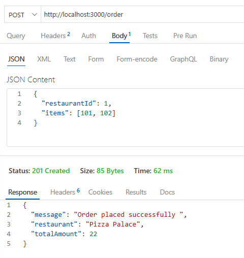

# Experiment 4

## Create a Food Delivery Website Backend to Handle HTTP Requests and Responses using Node.js

---

## Aim
To develop a simple food delivery backend application using **Node.js and Express** that allows users to view restaurants, view menu items from a particular restaurant, and place food orders using HTTP requests and responses.

---

## Technologies Used
- Node.js  
- Express.js  
- Body Parser  
- JavaScript  
- REST API  

---

## Application Setup
It is a simple **food delivery backend service** built using **Node.js and Express**.  
The server handles HTTP requests and returns responses in JSON format.

Users can:

- View restaurants  
- View food items from a particular restaurant  
- Place an order  

---

## Project Setup

Create project folder:
            mkdir Experiment-4
            cd Experiment-4
Initialize nodejs
            npm init -y
Install required packages:
            npm install express body-parser

---

### Folder structure
 
Experiment-4
│
├── node_modules
├── package.json
├── package-lock.json
└── server.js

---

### Run the project
            node server.js
            View all restuarants at http://localhost:3000
            view Menu of Restaurant 1 at http://localhost:3000/1/menu
            Place order using Thunder Client API at http://localhost:3000/order

---

### Output

