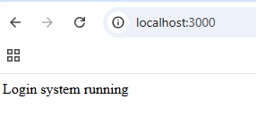
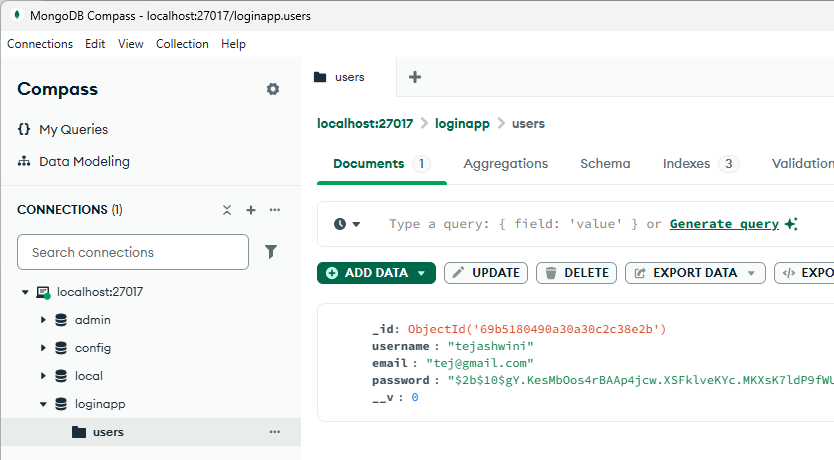

# Experiment 5

## Create a NodeJS Application for User Login System

---

### Aim
The aim of this experiment is to develop a user login system using **Node.js and MongoDB** that allows users to register and log in securely.

---

### Technologies Used
- Node.js
- Express.js
- MongoDB
- Mongoose
- bcryptjs
- JSON Web Token (JWT)
- dotenv

---

### Core Technologies

| Technology | Purpose |
|------|------|
Node.js | JavaScript runtime environment |
Express.js | Backend server framework |
MongoDB | Database to store user data |
Mongoose | ODM for MongoDB |
bcryptjs | Password hashing |
JWT | Token-based authentication |

---

### Project Setup

Create project folder:
mkdir node-login-system
cd node-login-system

Initialize Node project:

npm init -y

Install dependencies:

npm install express mongoose bcryptjs jsonwebtoken dotenv

---

### Folder Structure

node-login-system
│
├── server.js
├── .env
├── models
│ └── User.js
├── routes
│ └── auth.js
├── package.json
└── package-lock.json

---
### Running the Project

Start MongoDB locally.

Run the server:
        node server.js

Server will run at:
        http://localhost:3000

Use postman API to do CRUD operations on database as: 

    http://localhost:3000/api/auth/login
    http://localhost:3000/api/auth/register

### Output
The application successfully performs **user registration and login authentication using MongoDB and JWT tokens**.

