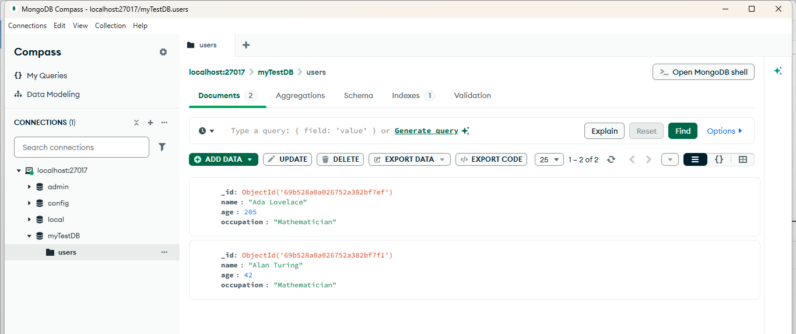

# MongoDB Basic Database Operations (Node.js)

## Experiment 6

### Aim
The aim of this experiment is to understand how to perform basic database operations using MongoDB and Node.js. These operations include creating a database, creating collections, inserting documents, querying data, updating records, and deleting documents.

---

### Prerequisites

Before running the program, ensure the following are installed:

- Node.js
- MongoDB Server

MongoDB should be running locally at: mongodb://localhost:27017

---

### Project Setup

Create project directory:

        mkdir node-mongo-app
        cd node-mongo-app

Initialize Node project:

        npm init -y

Install MongoDB driver:

        npm install mongodb

---

### Program File

Create a file:

        mongo-app.js

This program performs the following MongoDB operations:

1. Connects to MongoDB server
2. Creates a database
3. Creates a collection
4. Inserts one document
5. Inserts multiple documents
6. Reads all documents
7. Updates a document
8. Deletes a document
9. Lists all databases

---

### How to Run the Program

Start MongoDB server:

                mongosh


Run the Node.js program:

                node mongo-app.js

---

### Expected Output

The program will display messages showing:

- Successful connection to MongoDB
- Inserted documents
- Retrieved data
- Updated records
- Deleted records
- List of available databases

---

### Database Created

Database: myTestDB
Collection: users
MongoDB automatically creates the database and collection when the first document is inserted.

---

### Output

---

```text
C:\Users....\FSD-labExpeiments\Experiment-6> node mongo-app.js
Connected successfully to MongoDB

1. Inserting one document
Inserted ID: new ObjectId('69b528a0a026752a382bf7ef')

2. Inserting multiple documents
2 documents inserted

3. Reading all documents
[
  {
    _id: new ObjectId('69b528a0a026752a382bf7ef'),
    name: 'Ada Lovelace',
    age: 205,
    occupation: 'Mathematician'
  },
  {
    _id: new ObjectId('69b528a0a026752a382bf7f0'),
    name: 'Grace Hopper',
    age: 85,
    occupation: 'Computer Scientist'
  },
  {
    _id: new ObjectId('69b528a0a026752a382bf7f1'),
    name: 'Alan Turing',
    age: 41,
    occupation: 'Mathematician'
  }
]

4. Updating Alan Turing age
1 document updated

5. Deleting Grace Hopper
1 document deleted

6. List of databases
- admin
- config
- local
- myTestDB

MongoDB connection closed
