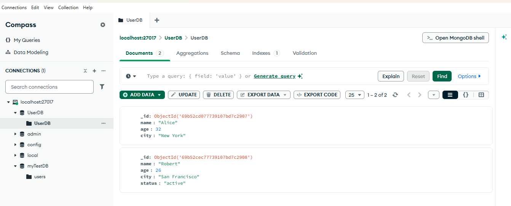

# Experiment 7

## Implement CRUD Operations on a Dataset using MongoDB

---

### Aim

The aim of this experiment is to implement the **Create, Read, Update, and Delete (CRUD)** operations on a MongoDB dataset using **MongoDB Shell (mongosh)** commands.

---

### Pre-requisites

- MongoDB Server installed and running locally or using MongoDB Atlas.
- MongoDB Shell (`mongosh`) installed.
- Basic understanding of MongoDB collections and documents.
- Ability to connect to the MongoDB server.

---

### Connect to MongoDB Shell

Open the terminal and run:

```bash
mongosh

## Create or Switch to Database

``` javascript
use userDB
```

MongoDB will automatically create the database when data is inserted.

------------------------------------------------------------------------

## CRUD Operations using MongoDB Shell

------------------------------------------------------------------------

## 1. Create Operations (Insert)

Create operations add new documents to a collection. If the collection
does not exist, MongoDB automatically creates it.

### Insert One Document

``` javascript
db.users.insertOne({
  name: "Alice",
  age: 30,
  city: "New York"
})
```

### Insert Multiple Documents

``` javascript
db.users.insertMany([
  { name: "Bob", age: 25, city: "Los Angeles" },
  { name: "Charlie", age: 35, city: "New York" }
])
```

------------------------------------------------------------------------

## 2. Read Operations (Query)

Read operations retrieve documents from a collection.

### Find All Users

``` javascript
db.users.find()
```

### Find Users from New York

``` javascript
db.users.find({ city: "New York" })
```

### Find Users Older than 30

``` javascript
db.users.find({ age: { $gt: 30 } })
```

### Find One User

``` javascript
db.users.findOne({ name: "Alice" })
```

------------------------------------------------------------------------

## 3. Update Operations (Modify)

Update operations modify existing documents in the collection.

### Update One Document

``` javascript
db.users.updateOne(
  { name: "Alice" },
  { $set: { age: 31 } }
)
```

### Update Multiple Documents

``` javascript
db.users.updateMany(
  {},
  { $inc: { age: 1 } }
)
```

### Replace One Document

``` javascript
db.users.replaceOne(
  { name: "Bob" },
  { name: "Robert", age: 26, city: "San Francisco", status: "active" }
)
```

------------------------------------------------------------------------

## 4. Delete Operations (Remove)

Delete operations remove documents from the collection.

### Delete One Document

``` javascript
db.users.deleteOne({ name: "Charlie" })
```

### Delete Multiple Documents

``` javascript
db.users.deleteMany({ age: { $gt: 30 } })
```

### Delete All Documents in Collection

``` javascript
db.users.deleteMany({})
```

------------------------------------------------------------------------

## Result

CRUD operations were successfully implemented on the MongoDB dataset
using **MongoDB Shell (mongosh)** commands.

### Output

