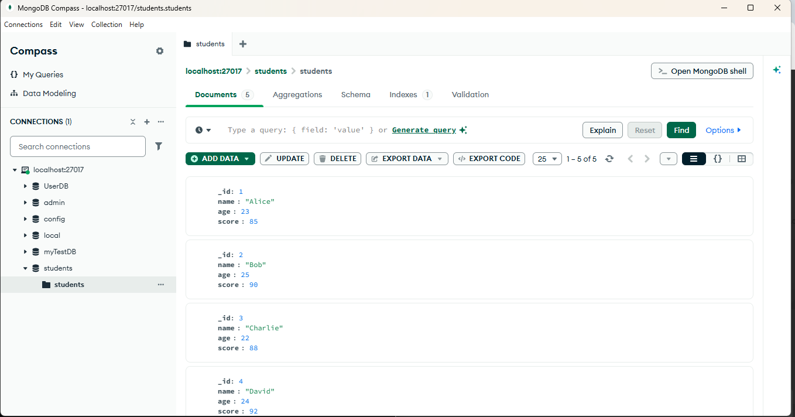

# Experiment 8

## Perform Count, Limit, Sort, and Skip Operations using MongoDB

---

## Aim

The aim of this experiment is to perform **counting of documents, sorting, limiting, and skipping operations** on collections in MongoDB databases.

---

## Dataset

For this experiment, assume a collection named **students** with the following documents:

```json
[
  { "_id": 1, "name": "Alice", "age": 23, "score": 85 },
  { "_id": 2, "name": "Bob", "age": 25, "score": 90 },
  { "_id": 3, "name": "Charlie", "age": 22, "score": 88 },
  { "_id": 4, "name": "David", "age": 24, "score": 92 },
  { "_id": 5, "name": "Eve", "age": 21, "score": 95 }
]
```

---

## MongoDB Operations

In MongoDB, the **countDocuments(), limit(), sort(), and skip()** operations are typically chained with the **find()** method to control data retrieval and ordering.

---

## 1. Count Documents

The **countDocuments()** method counts all documents or documents matching a specific query.

### Command

```javascript
db.students.countDocuments({})
```

### Output

```text
5
```

Meaning there are **5 records in the collection**.

---

## 2. Limit the Number of Documents

The **limit()** method restricts the number of documents returned by a query.

### Command

```javascript
db.students.find().limit(3)
```

### Output

```json
[
  { "_id": 1, "name": "Alice", "age": 23, "score": 85 },
  { "_id": 2, "name": "Bob", "age": 25, "score": 90 },
  { "_id": 3, "name": "Charlie", "age": 22, "score": 88 }
]
```

---

## 3. Sort Documents

The **sort()** method orders the query results.

- `1` → Ascending order  
- `-1` → Descending order

---

### Sort by Age in Ascending Order

#### Command

```javascript
db.students.find().sort({ age: 1 })
```

#### Output

```json
[
  { "_id": 5, "name": "Eve", "age": 21, "score": 95 },
  { "_id": 3, "name": "Charlie", "age": 22, "score": 88 },
  { "_id": 1, "name": "Alice", "age": 23, "score": 85 },
  { "_id": 4, "name": "David", "age": 24, "score": 92 },
  { "_id": 2, "name": "Bob", "age": 25, "score": 90 }
]
```

---

### Sort by Score in Descending Order

#### Command

```javascript
db.students.find().sort({ score: -1 })
```

#### Output

```json
[
  { "_id": 5, "name": "Eve", "age": 21, "score": 95 },
  { "_id": 4, "name": "David", "age": 24, "score": 92 },
  { "_id": 2, "name": "Bob", "age": 25, "score": 90 },
  { "_id": 3, "name": "Charlie", "age": 22, "score": 88 },
  { "_id": 1, "name": "Alice", "age": 23, "score": 85 }
]
```

---

## 4. Skip Documents

The **skip()** method bypasses a specified number of documents, useful for pagination.

### Command

```javascript
db.students.find().skip(2)
```

### Output

```json
[
  { "_id": 3, "name": "Charlie", "age": 22, "score": 88 },
  { "_id": 4, "name": "David", "age": 24, "score": 92 },
  { "_id": 5, "name": "Eve", "age": 21, "score": 95 }
]
```

---

## 5. Combine Operations

MongoDB operations can be chained together for more complex queries.

MongoDB processes operations in the following order:

1. `sort()`
2. `skip()`
3. `limit()`

---

### Example

Retrieve student records by **sorting scores in descending order**, **skipping the first 2 records**, and **limiting the result to 3 records**.

#### Command

```javascript
db.students.find().sort({ score: -1 }).skip(2).limit(3)
```

#### Output

```json
[
  { "_id": 2, "name": "Bob", "age": 25, "score": 90 },
  { "_id": 3, "name": "Charlie", "age": 22, "score": 88 },
  { "_id": 1, "name": "Alice", "age": 23, "score": 85 }
]
```

---

## Result

The **count, limit, sort, and skip operations** were successfully performed on the MongoDB **students collection** using MongoDB shell commands.

### Output

