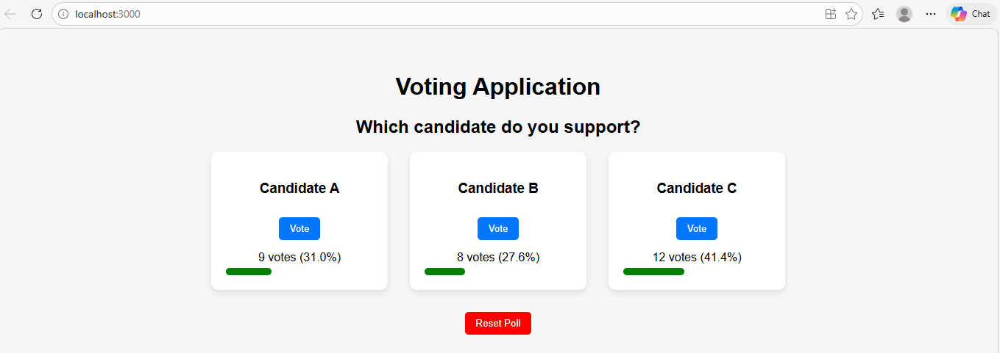

# React Voting Application

### Aim

The aim of this experiment is to develop a Voting Application using
ReactJS. The application allows users to vote for their favorite
candidate and dynamically displays the vote count and percentage for
each candidate.

------------------------------------------------------------------------

### Objective

-   Understand the basics of ReactJS.
-   Learn how to create functional components.
-   Use the `useState` hook to manage application state.
-   Dynamically update UI elements based on user interaction.

------------------------------------------------------------------------

### Technologies Used

-   ReactJS
-   JavaScript (ES6)
-   HTML5
-   CSS3
-   Node.js & npm

------------------------------------------------------------------------

### Project Setup

#### 1. Create the React App

Open terminal and run:

    npx create-react-app experiment-14
    cd experiment-14
    npm start

This will start the development server and open the application in your
browser:

    http://localhost:3000

### How the Application Works

1.  The application stores candidates and their votes using the
    `useState` hook.
2.  When a user clicks the **Vote** button, the vote count increases.
3.  The percentage of votes is calculated dynamically.
4.  A progress bar visually shows the vote distribution.
5.  The **Reset Poll** button resets all vote counts.

------------------------------------------------------------------------

### Output
---

