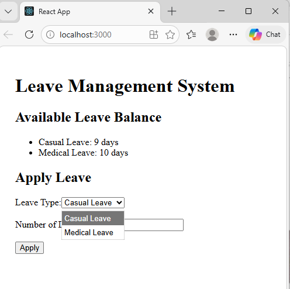
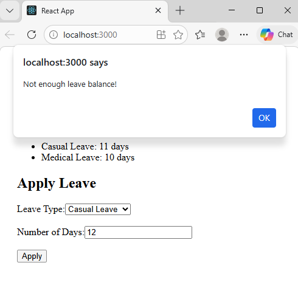
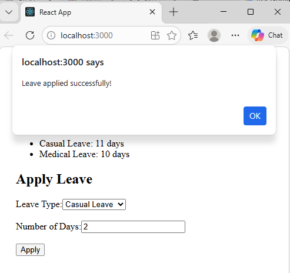

# Experiment 15 -- Leave Management System (ReactJS)

## Aim

To develop a Leave Management System using ReactJS that allows employees
to apply for different types of leaves such as Casual Leave and Medical
Leave, and view their available leave balance.

------------------------------------------------------------------------

### Objective

-   Learn component based architecture in React
-   Understand state management using `useState`
-   Implement form handling in React
-   Dynamically update UI based on user actions

------------------------------------------------------------------------

### Project Structure

    src/
    │
    ├── components/
    │   ├── LeaveBalance.jsx
    │   ├── ApplyLeave.jsx
    │
    ├── App.jsx
    └── index.js

------------------------------------------------------------------------

### Setup React Project

Open terminal and run:

    npx create-react-app experiment-15
    cd experiment-15
    npm start

The application will run at:

    http://localhost:3000

------------------------------------------------------------------------

### How the System Works

1.  The user opens the application.
2.  The available leave balance is displayed.
3.  The user selects the leave type (Casual / Medical).
4.  The user enters the number of leave days.
5.  When **Apply** is clicked:
    -   The system checks if enough leave balance exists.
    -   If available, leave days are deducted.
    -   UI updates instantly.
    -   Otherwise, an alert shows insufficient balance.

------------------------------------------------------------------------
### Output
---

