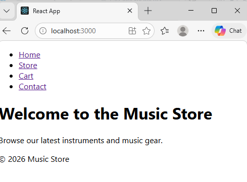
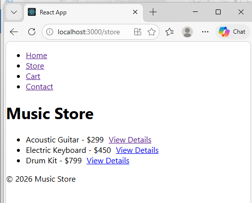
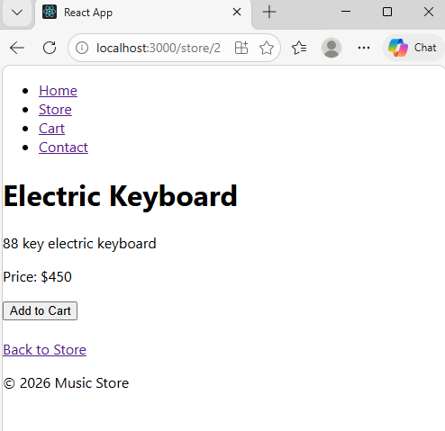
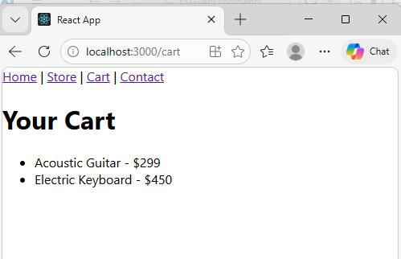

# Experiment 16 -- Music Store Application using React Router

## Aim

The aim of this experiment is to build a Music Store application using
React components and implement navigation between different web pages
using React Router.

------------------------------------------------------------------------

### Objective

-   Understand component-based architecture in React.
-   Implement routing using react-router-dom.
-   Create multiple pages within a React application.
-   Use dynamic routes to display product details.

------------------------------------------------------------------------

### Technologies Used

-   ReactJS
-   JavaScript (ES6)
-   HTML5
-   CSS3
-   React Router DOM

------------------------------------------------------------------------

### Project Setup

#### Step 1: Create React Project

Open terminal and run:

npx create-react-app experiment-16 cd experiment-16

#### Step 2: Install React Router

npm install react-router-dom

#### Step 3: Run the Application

npm start

The application will run at: http://localhost:3000

------------------------------------------------------------------------

### Project Structure

src/ │ ├── components/ │ ├── pages/ │ ├── Home.js │ ├── Store.js │ ├──
ProductDetail.js │ ├── Cart.js │ └── Contact.js │ ├── App.js └──
index.js

------------------------------------------------------------------------

### Application Features

1.  Home Page\
    Displays welcome message and introduction to the music store.

2.  Store Page\
    Lists available music instruments and products.

3.  Product Detail Page\
    Displays detailed information about a selected product using dynamic
    routing.

Example routes: /store/1 /store/2

4.  Cart Page\
    Displays products added to the shopping cart.

5.  Contact Page\
    Displays store contact information.

------------------------------------------------------------------------

### Routing Implementation

React Router is used to navigate between pages.

Example routes:

/ → Home Page /store → Store Page /store/:id → Product Detail Page /cart
→ Shopping Cart /contact → Contact Page

------------------------------------------------------------------------

### How the Application Works

1.  User opens the application.
2.  Navigation links allow movement between pages.
3.  Store page lists products.
4.  Clicking "View Details" opens the product detail page.
5.  Product details are displayed using a dynamic route.
6.  Users can add products to the cart.
7.  Cart page shows selected items.

------------------------------------------------------------------------

### Output

