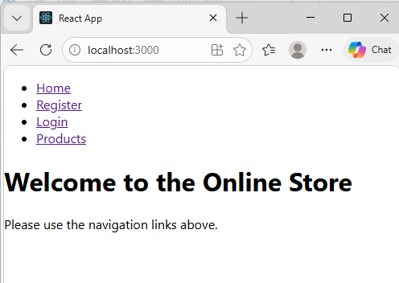
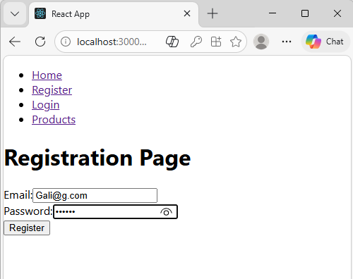
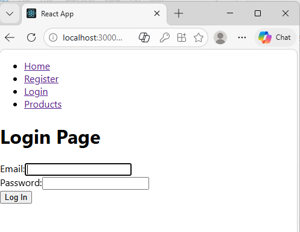
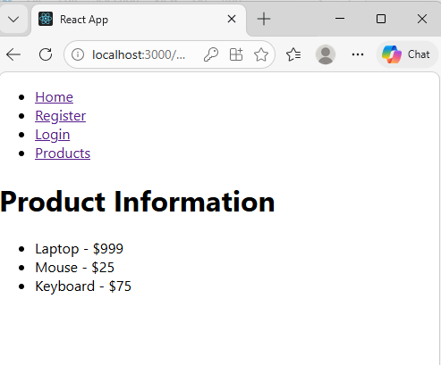

# Experiment 17 -- Online Store Application using ReactJS

## Aim

The aim of this experiment is to develop a ReactJS Online Store
Application that includes: - User Registration Page - Login Page -
Product Information Page - Navigation between pages using React Router

------------------------------------------------------------------------

### Objective

-   Understand multi-page navigation in React
-   Implement routing using **react-router-dom**
-   Create reusable components and pages
-   Build a simple online store interface

------------------------------------------------------------------------

### Technologies Used

-   ReactJS
-   JavaScript (ES6)
-   HTML5
-   CSS3
-   React Router DOM
-   Node.js and npm

------------------------------------------------------------------------

### Project Setup

#### Step 1: Create React Application

Open terminal and run:

    npx create-react-app experiment-17
    cd experiment-17

#### Step 2: Install React Router

    npm install react-router-dom

#### Step 3: Start the Development Server

    npm start

The application will run at:

    http://localhost:3000

------------------------------------------------------------------------

### Project Structure

    src/
    │
    ├── components/
    │   └── Navbar.js
    │
    ├── pages/
    │   ├── Home.js
    │   ├── Registration.js
    │   ├── Login.js
    │   └── Products.js
    │
    ├── App.js
    └── index.js

------------------------------------------------------------------------

### Application Pages

#### Home Page

Displays a welcome message and navigation links.

#### Registration Page

Allows new users to register with email and password.

#### Login Page

Allows existing users to log into the system.

#### Products Page

Displays a list of available products with price information.

------------------------------------------------------------------------

### Routing Implementation

React Router is used to navigate between pages.

Routes used in the application:

    /            → Home Page
    /register    → Registration Page
    /login       → Login Page
    /products    → Product Information Page

Navigation is implemented using the `Link` component from
**react-router-dom**.

------------------------------------------------------------------------

### How the Application Works

1.  User opens the application.
2.  Navigation menu allows movement between pages.
3.  User can go to the **Registration Page** to create an account.
4.  User can go to the **Login Page** to log in.
5.  The **Products Page** displays available items.
6.  React Router allows navigation without refreshing the page.

---

### Output

